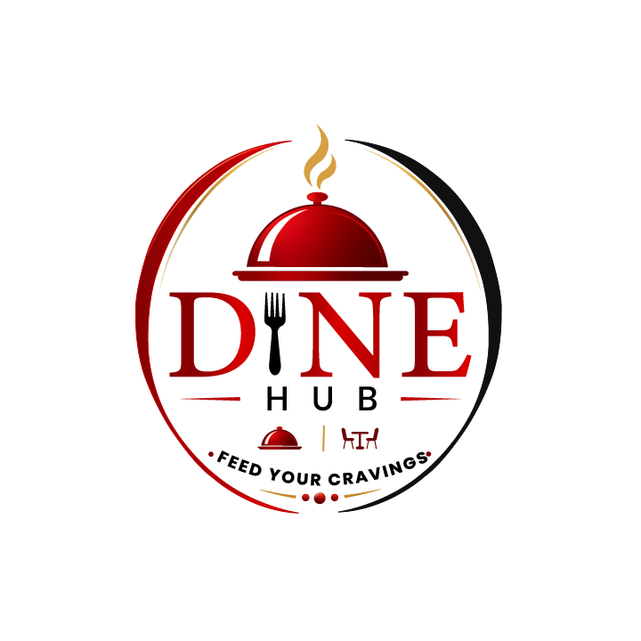

<div align="center">
  
  <h1>Dine Hub</h1>
  <p><strong>Feed Your Cravings</strong></p>
  <p>Restaurant Reservation Management System - Frontend Demo</p>

  
  
  
  
</div>

---

## 📋 Table of Contents

- [About](#about)
- [Features](#features)
- [Tech Stack](#tech-stack)
- [Installation](#installation)
- [Usage](#usage)
- [Project Structure](#project-structure)
- [Screenshots](#screenshots)
- [Future Enhancements](#future-enhancements)
- [Contributors](#contributors)
- [License](#license)

---

## 🍽️ About

**Dine Hub** is a modern Restaurant Reservation Management System built with React.js. It connects three types of users:

| Role | Description |
|------|-------------|
| 👤 **Customer** | Browse restaurants, book tables, order food, write reviews |
| 🏪 **Restaurant Owner** | Manage restaurant profile, menu, tables, reservations, orders & analytics |
| 👨‍💼 **Admin** | Oversee platform, manage users & restaurants, view analytics |

This is a **frontend demo** with mock data, designed for academic presentation purposes.

---

## ✨ Features

### Customer Portal
- 🔍 Browse & search restaurants with filters
- 📅 Book tables with date/time selection
- 🛒 Order food from restaurant menus
- 📊 View reservation & order history
- ⭐ Write & read reviews
- 📝 Read food blogs & watch vlogs

### Owner Portal
- 📈 Dashboard with revenue & reservation charts
- 🍽️ Menu management (add/edit/delete items)
- 🪑 Table management (Available/Occupied/Reserved)
- 📋 Reservation approval system
- 📦 Order tracking & management
- 📊 Analytics (revenue by category, daily orders)

### Admin Portal
- 👥 User management (ban/unban)
- 🏪 Restaurant approval system
- 📈 Platform-wide analytics
- 📄 Report generation & download

### Additional Features
- 🌙 Responsive design for all devices
- 🎨 Custom color theme matching brand logo
- 🔐 Role-based authentication (demo)
- 🎬 Blog & Vlog content pages

---

## 🛠️ Tech Stack

| Layer | Technology |
|-------|------------|
| **Framework** | React.js 18.2.0 |
| **Build Tool** | Vite 5.0.8 |
| **Styling** | Tailwind CSS 3.3.6 |
| **Routing** | React Router DOM 6.20.0 |
| **Icons** | Lucide React |
| **Charts** | Recharts |
| **Fonts** | Playfair Display, Inter (Google Fonts) |

---

## 🚀 Installation

### Prerequisites
- Node.js (v18 or higher)
- npm or yarn

### Steps

```bash
# 1. Clone or extract the project
cd dine-hub-react

# 2. Install dependencies
npm install

# 3. Start development server
npm run dev

# 4. Open browser
# http://localhost:5173
```

### Build for Production
```bash
npm run build
```

---

## 🎯 Usage

### Demo Login

| Role | Email | Password |
|------|-------|----------|
| Customer | any@email.com | anything |
| Owner | any@email.com | anything |
| Admin | any@email.com | anything |

> Select your role on the login page. This is a demo authentication system.

### Navigation

| URL | Page |
|-----|------|
| `/` | Landing Page |
| `/restaurants` | Restaurant Listing |
| `/restaurant/:id` | Restaurant Detail |
| `/menu/:id` | Menu & Order |
| `/blog` | Blog Listing |
| `/vlog` | Vlog Listing |
| `/login` | Login |
| `/register` | Register |
| `/customer/dashboard` | Customer Dashboard |
| `/owner/dashboard` | Owner Dashboard |
| `/admin/dashboard` | Admin Dashboard |

---

## 📂 Project Structure

```
dine-hub-react/
├── public/
│   ├── logo.png              # Dine Hub logo
│   └── favicon.ico
├── src/
│   ├── components/           # Reusable UI components
│   │   ├── Navbar/
│   │   ├── Footer/
│   │   ├── Sidebar/
│   │   ├── RestaurantCard/
│   │   ├── MenuItemCard/
│   │   ├── StatCard/
│   │   ├── ReviewCard/
│   │   ├── SearchBar/
│   │   ├── FilterDropdown/
│   │   ├── DataTable/
│   │   ├── ChartComponent/
│   │   └── VlogCard/
│   ├── pages/                # Route pages
│   │   ├── LandingPage.jsx
│   │   ├── RestaurantListingPage.jsx
│   │   ├── RestaurantDetailPage.jsx
│   │   ├── MenuPage.jsx
│   │   ├── BlogListingPage.jsx
│   │   ├── VlogListingPage.jsx
│   │   ├── LoginPage.jsx
│   │   ├── RegisterPage.jsx
│   │   ├── customer/
│   │   │   ├── CustomerDashboard.jsx
│   │   │   ├── MyReservations.jsx
│   │   │   ├── MyOrders.jsx
│   │   │   └── ReservationPage.jsx
│   │   ├── owner/
│   │   │   ├── OwnerDashboard.jsx
│   │   │   ├── ManageRestaurant.jsx
│   │   │   ├── ManageMenu.jsx
│   │   │   ├── ManageTables.jsx
│   │   │   ├── OwnerReservations.jsx
│   │   │   ├── OwnerOrders.jsx
│   │   │   └── OwnerAnalytics.jsx
│   │   └── admin/
│   │       ├── AdminDashboard.jsx
│   │       ├── ManageUsers.jsx
│   │       ├── ManageRestaurants.jsx
│   │       ├── AdminAnalytics.jsx
│   │       └── AdminReports.jsx
│   ├── layouts/              # Page layouts
│   │   ├── MainLayout.jsx
│   │   ├── AuthLayout.jsx
│   │   └── DashboardLayout.jsx
│   ├── contexts/             # Global state
│   │   └── AuthContext.jsx
│   ├── App.jsx               # Main router
│   ├── main.jsx              # Entry point
│   └── index.css             # Global styles
├── index.html
├── package.json
├── vite.config.js
├── tailwind.config.js
├── postcss.config.js
└── requirements.txt
```

---

## 🎨 Brand Colors

| Color | Hex | Usage |
|-------|-----|-------|
| Primary Red | `#C41E1E` | Buttons, links, accents |
| Gold | `#D4A017` | Highlights, badges, CTAs |
| Dark | `#1A1A1A` | Text, footer background |
| Cream | `#FFF8F0` | Page background |

---

## 🔮 Future Enhancements

- [ ] Backend API (Node.js + Express + MongoDB)
- [ ] Real authentication with JWT tokens
- [ ] Payment gateway integration (Stripe/EasyPaisa)
- [ ] Push notifications for reservations
- [ ] Google Maps integration
- [ ] AI-based restaurant recommendations
- [ ] Mobile app (React Native)
- [ ] Multi-language support (Urdu/English)

---

## 👥 Contributors

**Developer:**  Esha Eman
**Institution:** [Qalam IT Training]

---

## 📄 License

This project is for academic purposes. All rights reserved.

---

<div align="center">
  <p>Made By Web Developers Team of Qalam Trainees</p>
  <p><strong>Dine Hub - Feed Your Cravings</strong></p>
</div>
